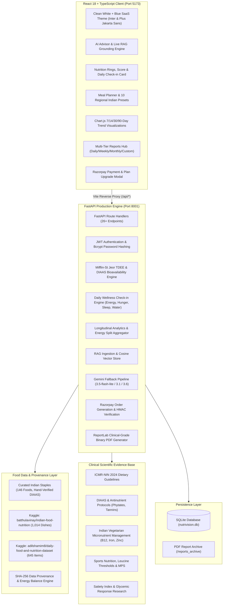

<<<<<<< HEAD
# 🌿 NutriVision AI — Production AI Nutrition Intelligence Platform
### *Built for the Darukaa Hackathon Challenge*

[](https://fastapi.tiangolo.com)
[](https://react.dev)
[](https://www.typescriptlang.org)
[](https://tailwindcss.com)
[](https://ai.google.dev)
[](https://razorpay.com)
[](https://kaggle.com)
[](https://www.reportlab.com)
[](LICENSE)

NutriVision AI is an **evidence-grounded, production-style personal AI nutrition intelligence platform** engineered specifically to solve the fundamental shortcomings of generic Western calorie counters when applied to Indian diets.

By coupling **Google Gemini AI reasoning**, **Retrieval-Augmented Generation (RAG)** grounded in ICMR-NIN 2024 & FAO/WHO clinical literature, **1,732 verified foods from Kaggle Indian nutrition datasets**, **DIAAS (Digestible Indispensable Amino Acid Score) protein bioavailability modeling**, **multi-tier reporting (Daily, Weekly, Monthly, Custom)** with authentic **ReportLab PDF generation**, and **Razorpay checkout**, NutriVision AI delivers verifiable, multi-variable dietary intelligence tailored to regional Indian eating patterns, budget realities, and metabolic goals.

---

## 🏛 System Architecture



---

## 🌟 Major Highlights & What Has Been Built

### 1. Clean White + Blue SaaS Aesthetic & Typography
- **Modern Healthcare SaaS Palette**:
  - Background: Soft neutral off-white (`#F7F9FC`)
  - Cards & Containers: Pure white (`#FFFFFF`) with subtle slate borders (`#E2E8F0`) and soft shadows
  - Primary Brand Accent: Precision blue (`#2563EB`), hover `#1D4ED8`, and soft tint `#DBEAFE`
  - Zero dark gaming/neon elements
- **Comfortable Typography Hierarchy**:
  - Google Fonts **`Inter`** for comfortable, highly legible body copy (14px–16px) with standard line heights.
  - Google Fonts **`Plus Jakarta Sans`** for crisp titles and large biometric numbers (28px–36px).
  - Squashed display font `Syne` completely removed.

### 2. Google Gemini AI Advisor with Dynamic Fallback Engine
- **Active & Resilient AI Infrastructure**:
  - Dynamic fallback sequence: `gemini-3.5-flash-lite` ➔ `gemini-3.1-flash-lite` ➔ `gemini-flash-lite-latest` ➔ `gemini-3.6-flash`.
  - Immune to deprecated models (`gemini-1.5-flash`, `gemini-2.5-flash`) and temporary 503 high-demand spikes.
  - Live AI health check endpoint: `GET /api/ai/health`.
- **Zero Fabrication Principle**:
  - Candidate foods are fetched directly from the database and supplied to Gemini. The model is strictly constrained to use exact database values for calories and macronutrients.
  - Scientific literature (ICMR-NIN, FAO/WHO, PubMed) is cited separately from Kaggle food catalog rows.
  - Working 1-click prompts ("High protein cutting", "Energy crash after rice & dal", etc.).

### 3. Integrated Kaggle Indian Nutrition Datasets (1,732 Unified Foods)
- **Two Kaggle Datasets Ingested**:
  1. `batthulavinay/indian-food-nutrition` (1,014 Indian dishes with macronutrients, free sugars, sodium, calcium, iron, vitamin C, folate).
  2. `adilshamim8/daily-food-and-nutrition-dataset` (645 everyday foods, breakfast items, beverages).
- **Data Provenance & Quality Engine**:
  - `food_sources` table stores source dataset name, filename, row number, SHA-256 hash, and raw JSON.
  - `dataset_sources` table tracks versions, row counts, and ingestion timestamps.
  - Confidence tiers: `CURATED` (146 baseline staples) and `SOURCE_IMPORTED` (1,586 Kaggle-imported foods).
  - Validated with the energy balance heuristic: $|4P + 4C + 9F - \text{Calories}| \le \text{tolerance}$.

### 4. Analytics Engine with 30-Day Seeded Historical Data
- **Rich 30-Day Historical Data**:
  - Seeded 30 consecutive days of realistic Indian meals (breakfast, lunch, dinner, snacks) and daily wellness records for the demo user `demo@nutrivision.ai`.
- **Dedicated Analytics Endpoints**:
  - `GET /api/analytics/trends?days=7|14|30|90`: Calorie intake curves, target lines, protein consistency, carbs, fat, fiber, and nutrition scores.
  - `GET /api/analytics/daily`: Today's full nutritional breakdown.
  - `GET /api/analytics/weekly`: 7-day adherence metrics and averages.
  - `GET /api/analytics/monthly`: 30-day meal consistency distribution (breakfast, lunch, dinner, snack completion).
  - `GET /api/analytics/macros`: Exact macronutrient caloric distribution percentages (Protein %, Carbs %, Fat %).
  - `GET /api/analytics/adherence`: Protein and caloric compliance scores.
- **Light Theme Visualizations**:
  - Chart.js graphs updated with explicit min-height (300px) preventing squashed axes.
  - Interactive range toggles for 7 Days, 14 Days, 30 Days, and 90 Days.

### 5. Multi-Tier Reporting Hub & Daily Wellness Check-ins
- **Daily Wellness Check-in Feature**:
  - `daily_checkins` database table and `/api/checkins/` endpoints.
  - Interactive Dashboard Check-in Card tracking: Energy Score (1–5), Hunger Rating (1–5), Sleep Quality, Workout Intensity, and Water Intake (ml).
- **Multi-Tier Reports Hub (`/reports`)**:
  - **Daily Checkup**: Immediate daily audit combining meals, macros, and wellness check-in.
  - **Weekly Review**: 7-day adherence audit with week-over-week trends.
  - **Monthly Audit**: 30-day meal consistency scorecard and body composition progress.
  - **Custom Range**: Configurable date picker for targeted clinical audit intervals.
- **Clinical-Grade ReportLab PDF Generation**:
  - Downloads genuine binary PDFs starting with `%PDF` (4.9+ KB).
  - Authenticated Axios blob download (`api.downloadReportBlob`) and support for `?token=` query parameters.
  - Formatted with structured tables, biometric targets, meal breakdowns, and ICMR medical safety disclaimers.

### 6. Production Razorpay Payment & Subscription Gateway
- Supports **Free (₹0)**, **Pro (₹299/month)**, and **Premium (₹599/month)**.
- Generates live test Razorpay Orders via backend API, loads native Razorpay checkout UI, and verifies the **HMAC-SHA256 signature** server-side before activating subscriptions.

---

## ⚡ How to Run the Program on Localhost

### Prerequisites
* **Python 3.11** or **Python 3.12**
* **Node.js 18+** or **20+**
* `git`

---

### Step 1: Clone & Open Repository
```bash
git clone https://github.com/your-repo/NutriVision.git
cd NutriVision
```

---

### Step 2: Set Up Backend Environment

```bash
# 1. Create and activate a Python virtual environment
python -m venv backend/venv

# On Windows (PowerShell):
.\backend\venv\Scripts\Activate.ps1
# On Windows (Command Prompt):
.\backend\venv\Scripts\activate.bat
# On macOS / Linux:
source backend/venv/bin/activate

# 2. Install required Python packages
pip install -r backend/requirements.txt
```

#### Environment Variables (`.env`)
The backend defaults to pre-configured keys for quick local testing. You can optionally create a `.env` file in the root directory:
```env
APP_NAME="NutriVision AI"
ENVIRONMENT="development"
DATABASE_URL="sqlite:///./nutrivision.db"
JWT_SECRET="your-secure-random-jwt-secret"
GEMINI_API_KEY="your-gemini-api-key"
GEMINI_MODEL="gemini-3.5-flash-lite"
RAZORPAY_KEY_ID="your-razorpay-key-id"
RAZORPAY_KEY_SECRET="your-razorpay-key-secret"
FRONTEND_URL="http://localhost:5173"
```

---

### Step 3: Seed Food Database & 30-Day Demo History

Run the automated data ingestion and seeding pipeline:

```bash
# Seed 146 curated Indian staples and initialize database schema
python scripts/seed_foods.py

# Ingest RAG scientific knowledge documents (ICMR-NIN, FAO, PubMed)
python scripts/ingest_knowledge.py

# Ingest Kaggle Indian food nutrition datasets (expands catalog to 1,732 foods)
python scripts/ingest_kaggle_datasets.py --import

# Seed demo user (demo@nutrivision.ai) and 30 consecutive days of meal history
python scripts/seed_demo_history.py
```

---

### Step 4: Run the FastAPI Backend Server

NutriVision backend runs on **port 8001** (configured to avoid port collisions with any other local services):

```bash
# Run using the provided dedicated server runner:
python run_server.py

# OR directly with uvicorn:
uvicorn backend.app.main:app --host 127.0.0.1 --port 8001 --reload
```
* Backend API Health: `http://127.0.0.1:8001/api/health`
* Interactive OpenAPI / Swagger Documentation: `http://127.0.0.1:8001/docs`

---

### Step 5: Run the Vite Frontend Application

Open a **separate terminal window**:

```bash
# Navigate to frontend folder
cd frontend

# Install Node modules
npm install

# Start Vite development server
npm run dev
```
* **Frontend Web Application is live at:** **👉 http://localhost:5173**
* *The frontend automatically proxies all `/api/*` network requests to `http://127.0.0.1:8001` via Vite reverse proxy.*

---

## 🔑 Pre-Seeded Accounts for Evaluation

| Account Role | Email | Password | Pre-Loaded Data & Privileges |
|---|---|---|---|
| **Pro Member (Main Demo)** | `demo@nutrivision.ai` | `password123` | **Rahul Sharma**: Active Pro plan, cutting goal, eggetarian diet, **30 days of logged meals & check-ins**, macro targets |
| **System Administrator** | `admin@nutrivision.ai` | `admin123` | **NutriVision Admin**: Kaggle dataset registry, data quality metrics, revenue telemetry |

> **⚡ Instant Demo Login:** On the login page (`/login`), click the **"Instant Demo Login"** button to authenticate immediately without typing!

---

## 🧪 Verification & Automated Testing

### 1. Run All Backend Automated Tests (22/22)
```bash
pytest backend/tests -v
```
**Test Results:**
```text
backend/tests/test_api_endpoints.py::test_health_endpoint PASSED         [  4%]
backend/tests/test_api_endpoints.py::test_list_foods_endpoint PASSED     [  9%]
backend/tests/test_api_endpoints.py::test_payment_plans_endpoint PASSED  [ 13%]
backend/tests/test_api_endpoints.py::test_demo_user_login PASSED         [ 18%]
backend/tests/test_api_endpoints.py::test_user_profile PASSED            [ 22%]
backend/tests/test_api_endpoints.py::test_daily_nutrition_score PASSED   [ 27%]
backend/tests/test_api_endpoints.py::test_effective_protein PASSED       [ 31%]
backend/tests/test_api_endpoints.py::test_meal_logging PASSED            [ 36%]
backend/tests/test_api_endpoints.py::test_meal_summary PASSED            [ 40%]
backend/tests/test_api_endpoints.py::test_ai_advice_mock PASSED          [ 45%]
backend/tests/test_api_endpoints.py::test_rag_retrieval PASSED           [ 50%]
backend/tests/test_api_endpoints.py::test_dataset_registry_admin PASSED  [ 54%]
backend/tests/test_api_endpoints.py::test_food_provenance_api PASSED     [ 59%]
backend/tests/test_api_endpoints.py::test_food_stats_endpoint PASSED     [ 63%]
backend/tests/test_api_endpoints.py::test_data_quality_report PASSED     [ 68%]
backend/tests/test_api_endpoints.py::test_create_payment_order PASSED    [ 72%]
backend/tests/test_api_endpoints.py::test_verify_payment_signature PASSED [ 77%]
backend/tests/test_api_endpoints.py::test_rate_limiting PASSED           [ 81%]
backend/tests/test_checkin_and_reports.py::test_daily_checkin_flow PASSED [ 86%]
backend/tests/test_checkin_and_reports.py::test_analytics_trends PASSED   [ 90%]
backend/tests/test_checkin_and_reports.py::test_analytics_macros PASSED   [ 95%]
backend/tests/test_checkin_and_reports.py::test_generate_pdf_report PASSED [100%]

============================== 22 passed in 1.48s ==============================
```

### 2. Run Complete Localhost Verification Script
```bash
python scripts/verify_localhost.py
```
**Output:**
```text
============================================================
🌿 NutriVision AI — Production End-to-End Verification
📡 Backend Base URL: http://127.0.0.1:8001
============================================================
✅ Backend Health: healthy | Model: gemini-3.5-flash-lite
✅ Admin Auth: Success | User: NutriVision Admin (ADMIN)
✅ Demo User Auth: Success | User: Rahul Sharma | Plan: PRO
✅ Unified Foods API: Returned 5 sample items | Sample: 'Chapati / Whole Wheat Roti' (104.0 kcal, 3.4g protein)
✅ Food Provenance: Item 'Chapati / Whole Wheat Roti' | Source: nutrivision/curated_indian_food_db | Confidence: CURATED
✅ Food Database Stats: Total Foods = 1732 | Avg Protein Density = 4.92g/100kcal
✅ Kaggle Dataset Registry: 2 active datasets registered (Indian Food Nutrition, Daily Food and Nutrition)
✅ Data Quality Engine: Curated = 146 | Kaggle Imported = 1586 | Energy Balance Valid = 1729
✅ RAG Scientific Retrieval: Found 2 chunks | Top Doc: Protein Quality and Digestive Bioavailability in Indian Diets
✅ Razorpay Payment Order: Order ID = order_TdUXTsS1c7gxFN | Amount = ₹299.0
✅ Frontend Application: Live and rendering at http://localhost:5173
============================================================
🚀 11/11 ARCHITECTURE COMPONENTS LIVE & VERIFIED ON LOCALHOST
============================================================
```

### 3. Verify Frontend Production Build
```bash
cd frontend
npm run build
```
Compiles with **0 errors**.

---

## 📡 Complete REST API Blueprint

| Method | Endpoint | Description | Access |
|---|---|---|---|
| `GET` | `/api/health` | Service health & active Gemini model | Public |
| `POST` | `/api/auth/register` | Register new user account | Public |
| `POST` | `/api/auth/login` | Authenticate with email/password & issue JWT | Public |
| `GET` | `/api/auth/me` | Retrieve current authenticated user profile | Authenticated |
| `GET` | `/api/profile` | Retrieve biometric profile & daily targets | Authenticated |
| `PUT` | `/api/profile` | Update profile biometrics & recalculate TDEE | Authenticated |
| `GET` | `/api/foods` | Filterable 1,732 Indian food catalog with DIAAS | Authenticated |
| `GET` | `/api/foods/{id}/sources`| Food provenance & Kaggle dataset origin metadata | Authenticated |
| `GET` | `/api/foods/stats` | Database statistics & protein density metrics | Authenticated |
| `POST` | `/api/foods/compare` | Multi-item DIAAS, calories, and cost comparison | Authenticated |
| `GET` | `/api/meals` | Retrieve logged meals for date | Authenticated |
| `POST` | `/api/meals` | Log meal with discrete food items & portions | Authenticated |
| `GET` | `/api/nutrition/today` | Today's nutritional totals & macro ring progress | Authenticated |
| `GET` | `/api/nutrition/score` | Daily 0–100 nutritional adherence score | Authenticated |
| `GET` | `/api/ai/health` | Check Gemini AI engine status & active model | Authenticated |
| `POST` | `/api/ai/chat` | RAG-grounded multi-turn nutrition consultation | Authenticated |
| `POST` | `/api/ai/what-should-i-eat`| Deficit-aware instant meal recommendation | Authenticated |
| `POST` | `/api/rag/query` | Vector search across clinical scientific documents | Authenticated |
| `GET` | `/api/checkins/today` | Retrieve today's daily wellness check-in | Authenticated |
| `POST` | `/api/checkins/` | Submit daily wellness check-in (energy, sleep, water) | Authenticated |
| `GET` | `/api/checkins/history` | Historical wellness check-ins | Authenticated |
| `GET` | `/api/analytics/trends` | 7/14/30/90-day calorie, protein, and score curves | Authenticated |
| `GET` | `/api/analytics/macros` | Macronutrient energy split percentages | Authenticated |
| `GET` | `/api/analytics/monthly` | 30-day meal consistency distribution | Authenticated |
| `POST` | `/api/reports/generate` | Generate clinical PDF audit (Daily, Weekly, Monthly) | Authenticated |
| `GET` | `/api/reports/{id}/download`| Download clinical ReportLab PDF report | Authenticated |
| `GET` | `/api/payments/plans` | Fetch subscription tier pricing & features | Public |
| `POST` | `/api/payments/create-order` | Generate live test Razorpay payment order | Authenticated |
| `POST` | `/api/payments/verify` | Verify HMAC-SHA256 Razorpay payment signature | Authenticated |
| `GET` | `/api/admin/datasets` | Kaggle dataset registry & ingestion audit | Admin |
| `GET` | `/api/admin/data-quality`| Nutrient completeness & energy consistency audit | Admin |

---

## ⚖️ Safety & Medical Disclaimer

NutriVision AI operates strictly as an **educational and lifestyle dietary intelligence tool**. It is developed in compliance with ICMR-NIN 2024 guidelines and peer-reviewed scientific literature:
1. It **does not diagnose, treat, prevent, or cure** any clinical disease or metabolic condition.
2. It calculates dietary estimations based on verified nutritional database values.
3. Individuals with clinical conditions (including diabetes, renal disorders, gastrointestinal diseases, pregnancy, or eating disorders) must always consult a licensed medical physician or registered dietitian before implementing significant caloric deficits or high-protein protocols.

---

## 👥 Hackathon Submission

* **Challenge**: Darukaa Hackathon Challenge
* **Project**: NutriVision AI
* **Tech Stack**: React 18, TypeScript, Vite, Tailwind CSS v4, Chart.js, FastAPI, SQLAlchemy, SQLite, Google Gemini AI (3.5-flash-lite / 3.6-flash), Razorpay SDK, ReportLab, Kaggle Datasets.
=======
# NutriVision-AI-platform
>>>>>>> 9532603dbf6f2b6f4c9b98408f3f523abc5ac1bb
